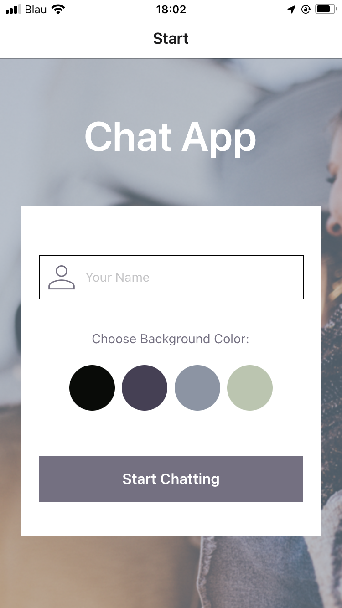
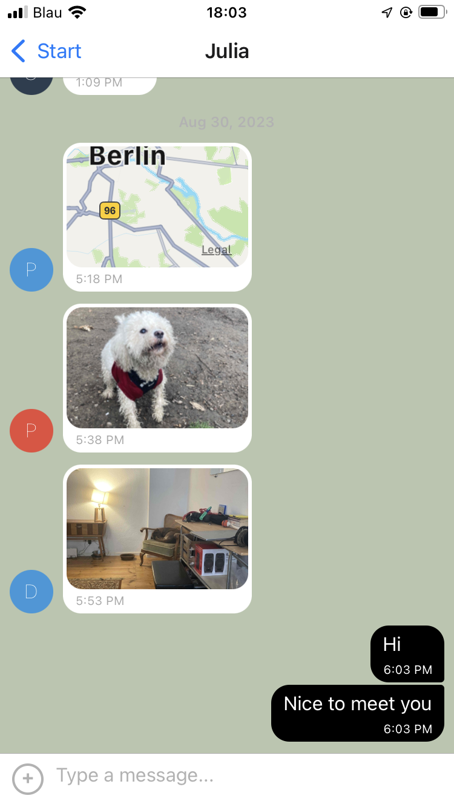

# Chat App Documentation

This documentation provides an overview of the Chat App, a React Native application. The app allows users to chat with each other in real-time. Below, you will find instructions for setting up the app and an explanation of its features.

## Table of Contents

- [Installation](#installation)
- [Features](#features)
  - [Start Screen](#start-screen)
  - [Chat Screen](#chat-screen)
- [Custom Actions](#custom-actions)

## Installation

To run the Chat App on your local machine, follow these steps:

1. Clone the repository from GitHub:

   ```bash
   git clone https://github.com/your-username/chat-app.git
   ```

2. Navigate to the project directory:

   ```bash
   cd chat-app
   ```

3. Install the dependencies using npm or yarn:

   ```bash
   npm install
   # or
   yarn install
   ```

4. Configure Firebase:

   - Create a Firebase project on the Firebase Console (https://console.firebase.google.com/).
   - Obtain the Firebase configuration object (apiKey, authDomain, projectId, storageBucket, messagingSenderId, appId) and update the `firebaseConfig` object in `App.js`.

5. Start the application:

   ```bash
   npm start
   # or
   yarn start
   ```

6. Follow the instructions in the terminal to run the app on a device or emulator.

## Features

### Start Screen

The Start Screen is the initial screen where users set their name, choose a background color, and start chatting.

- **User Name**: Users can enter their name in the text input field.

- **Background Color**: Users can select a background color for the chat screen from four predefined options.

- **Start Chatting Button**: Initiates the chat session after selecting a name and background color. It navigates the user to the Chat Screen.



### Chat Screen

The Chat Screen is where users can send and receive messages in real-time.

- **Chat Messages**: Displays chat messages in a conversation format, with user messages on the right and other users' messages on the left. Messages include text and can also include images and location maps.

- **Input Toolbar**: Provides an input area at the bottom for composing and sending new messages.

- **Custom Actions**: Users can access a menu of custom actions, allowing them to:

  - Choose an image from the device's gallery and send it.
  - Take a picture using the device's camera and send it.
  - Share their current location.

- **Real-time Updates**: Messages are updated in real-time as new messages are sent by other users.



## Custom Actions

The Chat App includes custom actions that enhance the chat experience.

- **Image Selection**: Users can choose an image from their device's gallery, and the app will upload and display the image in the chat.

- **Camera Integration**: Users can take a picture using their device's camera, and the app will upload and display the image in the chat.

- **Location Sharing**: Users can share their current location, and the app will display a map with their location to other users in the chat.

These actions can be accessed through the "+" button located in the chat input area.

---

This documentation provides an overview of the Chat App's installation process and its key features. Users can enjoy real-time chat functionality with the ability to send text, images, and locations. Custom actions enhance the chat experience, making it more interactive and engaging.
